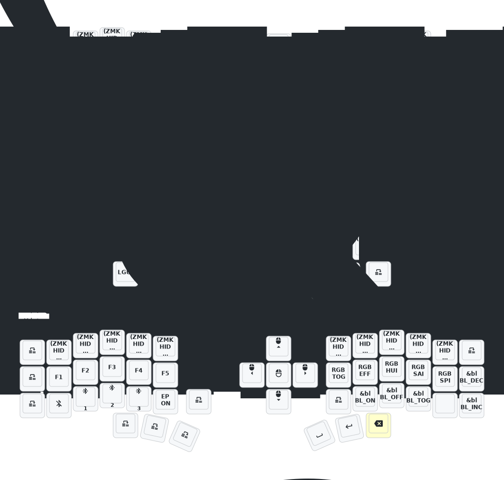

- [中文](README.md)
- [English](README_EN.md)

## Notes for this fork (toffmee)

- **Pinned builds:** `config/west.yml` pins the `eyelash_corne` module to the last
  revision that still ships the `eyelash_corne_left/right` boards, and ZMK (plus the
  build workflow) to `v0.3.0`. Newer module revisions (June 2026 onward) switched to a
  nice_nano_v2 shield layout that depends on the cormoran/zmk fork — updating means
  redoing `build.yaml` and `west.yml` together, not just bumping revisions.
- **Screens & power rail:** the nice!view-compatible screens are fed from the switched
  external power rail. `CONFIG_ZMK_RGB_UNDERGLOW_EXT_POWER=n` keeps RGB on/off from
  cutting that rail (with it unset, RGB idle auto-off used to kill the screens
  permanently, because the off state persists to flash settings).
- **Recovery:** if the screens ever stay dark across reboots, press the `EP_ON` key on
  the NUMBER layer (left hand, next to `BT 2`) — it re-enables external power on both
  halves and persists. Flashing `settings_reset` also works but wipes Bluetooth bonds.
  The screens are only readable at full backlight; backlight keys live on the NUMBER
  layer's right hand.
- **Flashing:** keymap-only changes need just the left (central) half reflashed. The
  keymap-drawer bot pushes a `[Draw]` commit after each push, so `git pull --rebase`
  before pushing.

# 睫毛外设 (Eyelash Peripherals) Corne ZMK 仓库

**该键盘与 [foostan's Corne](https://github.com/foostan/crkbd) 不同，无法与标准的 `corne` 固件兼容。**

如果您需要该键盘的 3D 模型，请发送电子邮件至 `380465425@qq.com`。

## 使用说明

1. [叉取此仓库](https://docs.github.com/en/get-started/quickstart/fork-a-repo#forking-a-repository)。
2. [点击 **Actions** 选项卡，确保工作流已启用](https://docs.github.com/en/actions/managing-workflow-runs-and-deployments/managing-workflow-runs/disabling-and-enabling-a-workflow#enabling-a-workflow)。
3. 确保 [`config/west.yml`](config/west.yml) 中的 `eyelash_corne` 项目仍然有效。`boards/arm/eyelash_corne` 文件夹将从此 URL 下载。
4. 如果您的叉取中仍存在 `boards/arm/eyelash_corne` 文件夹，请将其删除。

**如果您已经有 ZMK 配置仓库，[您可以将此作为模块添加，而不是叉取](https://zmk.dev/docs/features/modules#building-with-modules)。**

## Corne 键位图

fork
